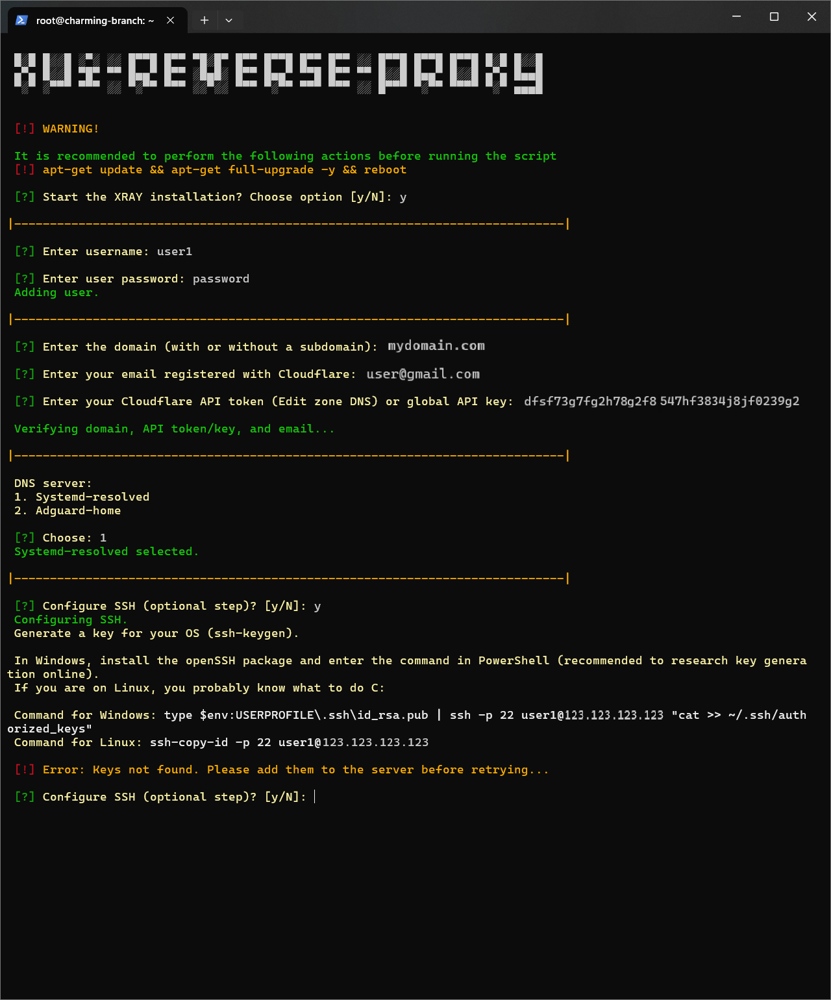

# XUI-REVERSE-PROXY ([Russian](/README_RU.md))  


<p align="center"><a href="#"></a></p>

-----

### Proxy using VLESS-TCP-XTLS-Vision and VLESS-TCP-REALITY (Steal oneself) behind reverse-proxy NGINX
This script is designed to quickly and easily set up a hidden proxy server, with masking via NGINX. In this variant, all incoming requests are handled by NGINX, and the server acts as a proxy server only if the request contains the correct path (URI). This increases security and helps to hide the true purpose of the server.

> [!IMPORTANT]
>  This script has been tested in a KVM virtualization environment. You will need your own domain, which needs to be bound to Cloudflare for it to work correctly. It is recommended to run the script as root on a freshly installed system.

> [!NOTE]
> The script is configured according to routing rules for users in Russia.

### Supported Operating Systems:

| **Ubuntu**       | **Debian**        | **CentOS**       |
|------------------|-------------------|------------------|
| 24.04 LTS        | 12 (bookworm)     | Stream 9         |
| 22.04 LTS        | 11 (bullseye)     | Stream 8         |
| 20.04 LTS        | 10 (buster)       | 7                |

-----

### Setting up cloudflare
1. Upgrade the system and reboot the server.
2. Configure Cloudflare:
   - Bind your domain to Cloudflare.
   - Add the following DNS records:

| Type  | Name             | Content          | Proxy status  |
| ----- | ---------------- | ---------------- | ------------- |
| A     | your_domain_name | your_server_ip   | DNS only      |
| CNAME | www              | your_domain_name | DNS only      |
   
3. SSL/TLS settings in Cloudflare:
   - Go to SSL/TLS > Overview and select Full for the Configure option.
   - Set the Minimum TLS Version to TLS 1.3.
   - Enable TLS 1.3 (true) under Edge Certificates.

-----

### Includes:
  
1. Xray server configuration with 3X-UI:
   - VLESS-TCP-XTLS-Vision и VLESS-TCP-REALITY (Steal oneself).
   - Connection of subscription and JSON subscription for automatic configuration updates.
2. Configuring NGINX reverse proxy on port 443.
3. providing security:
   - Automatic system updates via unattended-upgrades.
4. Configuring Cloudflare SSL certificates with automatic updates to secure connections.
5. Configuring WARP to protect traffic.
6. Enabling BBR - improving the performance of TCP connections.
7. Configuring UFW (Uncomplicated Firewall) for access control.
8. Configuring SSH, to provide the minimum required security.
9. Disabling IPv6 to prevent possible vulnerabilities.
10. Encrypting DNS queries using systemd-resolved (DoT) or AdGuard Home (Dot, DoH).
11. Selecting a random website from an array to add an extra layer of privacy and complexity for traffic analysis.

-----

### Help message of the script:
```
Usage: xui-rp-install-server.sh [-g|--generate <true|false>] [-u|--utils <true|false>] [-d|--dns <true|false>]
                 [-a|--addu <true|false>] [-r|--autoupd <true|false>] [-b|--bbr <true|false>] [-i|--ipv6 <true|false>]
                 [-w|--warp <true|false>] [-c|--cert <true|false>] [-m|--mon <true|false>] [-n|--nginx <true|false>]
                 [-p|--panel <true|false>] [-f|--firewall <true|false>] [-s|--ssh <true|false>] [-t|--tgbot <true|false>]
                 [-h|--help]

  -g, --generate <true|false>    Generate a random string for configuration     (default: true)
  -u, --utils <true|false>       Additional utilities                           (default: true)
  -d, --dns <true|false>         DNS encryption                                 (default: true)
  -a, --addu <true|false>        User addition                                  (default: true)
  -r, --autoupd <true|false>     Automatic updates                              (default: true)
  -b, --bbr <true|false>         BBR (TCP Congestion Control)                   (default: true)
  -i, --ipv6 <true|false>        Disable IPv6 support                           (default: true)
  -w, --warp <true|false>        Warp                                           (default: true)
  -c, --cert <true|false>        Certificate issuance for domain                (default: true)
  -m, --mon <true|false>         Monitoring services (node_exporter)            (default: false)
  -n, --nginx <true|false>       NGINX installation                             (default: true)
  -p, --panel <true|false>       Panel installation for user management         (default: true)
  -f, --firewall <true|false>    Firewall configuration                         (default: true)
  -s, --ssh <true|false>         SSH access                                     (default: true)
  -t, --tgbot <true|false>       Telegram bot integration                       (default: false)
  -h, --help                     Display this help message

```

### Installation of XUI-RP:

To begin configuring the server, simply run the following command in a terminal:
```sh
bash <(curl -Ls https://github.com/cortez24rus/xui-reverse-proxy/raw/refs/heads/main/xui-rp-install-server.sh)
```

### Installing a random template for the website:
```sh
bash <(curl -Ls https://github.com/cortez24rus/xui-reverse-proxy/raw/refs/heads/main/xui-rp-random-site.sh)
```

The script will then prompt you for the necessary configuration information:

<p align="center"><a href="#"></a></p>

### Note: 
- Once the configuration is complete, the script will display all the necessary links and login information for the XUI administration panel.
- All configurations can be modified as needed due to the flexibility of the settings.

-----

> [!IMPORTANT]
> This repository is intended solely for educational purposes and for studying the principles of reverse proxy servers and network security. The script demonstrates the setup of a proxy server using NGINX for reverse proxy, traffic management, and attack protection.
>
>We strongly remind you that using this tool to bypass network restrictions or censorship is illegal in certain countries that have laws regulating the use of technologies to circumvent internet restrictions.
>
>This project is not intended for use in ways that violate information protection laws or interfere with censorship mechanisms. We take no responsibility for any legal consequences arising from the use of this script.
>
>Use this tool/script only for demonstration purposes, as an example of reverse proxy operation and data protection. We strongly recommend removing the script after reviewing it. Further use is at your own risk.
>
>If you are unsure whether the use of this tool or its components violates the laws of your country, refrain from interacting with this tool.

-----

## Stargazers over time
[](https://starchart.cc/cortez24rus/xui-reverse-proxy)
