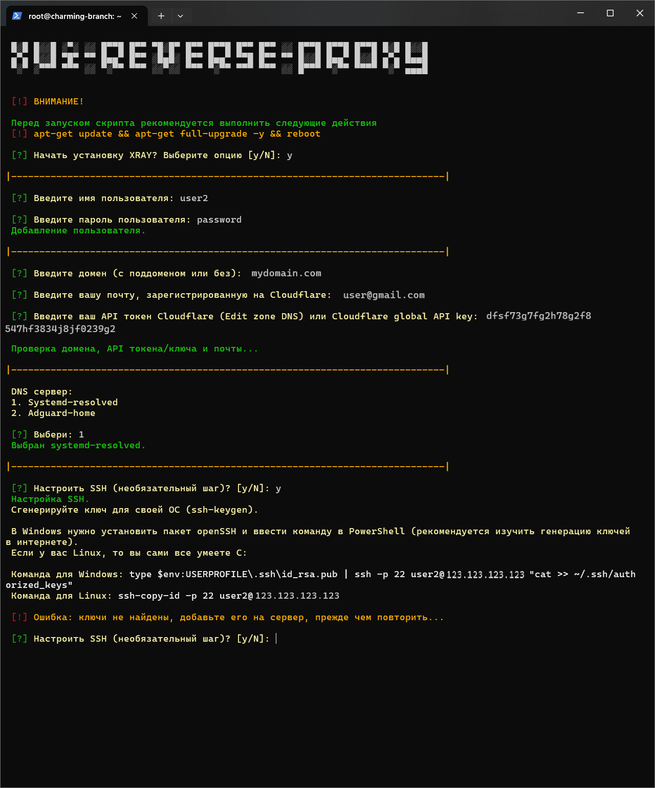

# XUI-REVERSE-PROXY ([English](/README.md)) 
<p align="center"><a href="#"></a></p>

-----

### Прокси с использованием  VLESS-TCP-XTLS-Vision и VLESS-TCP-REALITY (Steal oneself) за реверс-прокси NGINX
Этот скрипт предназначен для быстрой и простой настройки скрытого прокси-сервера, с маскировкой через NGINX. В данном варианте все входящие запросы обрабатываются NGINX, а сервер работает как прокси-сервер только при условии, что запрос содержит правильный путь (URI). Это повышает безопасность и помогает скрыть истинное назначение сервера.

> [!IMPORTANT]
> Этот скрипт был протестирован в среде виртуализации KVM. Для корректной работы вам потребуется собственный домен, который` необходимо привязать к Cloudflare. Скрипт рекомендуется запускать с правами root на свежеустановленной системе.

> [!NOTE]
> Скрипт настроен с учётом специфики маршрутизации для пользователей из России.

### Поддерживаемые операционные системы:

| **Ubuntu**       | **Debian**        | **CentOS**       |
|------------------|-------------------|------------------|
| 24.04 LTS        | 12 (bookworm)     | Stream 9         |
| 22.04 LTS        | 11 (bullseye)     | Stream 8         |
| 20.04 LTS        | 10 (buster)       | 7                |

-----

### Настройка cloudflare
1. Обновите систему и перезагрузите сервер.
2. Настройте Cloudflare:
   - Привяжите ваш домен к Cloudflare.
   - Добавьте следующие DNS записи:

| Type  | Name             | Content          | Proxy status  |
| ----- | ---------------- | ---------------- | ------------- |
| A     | your_domain_name | your_server_ip   | DNS only      |
| CNAME | www              | your_domain_name | DNS only      |
   
3. Настройки SSL/TLS в Cloudflare:
   - Перейдите в раздел SSL/TLS > Overview и выберите Full для параметра Configure.
   - Установите Minimum TLS Version на TLS 1.3.
   - Включите TLS 1.3 (true) в разделе Edge Certificates.

-----

### Включает в себя:
  
1. Конфигурация сервера Xray с 3X-UI:
   - VLESS-TCP-XTLS-Vision и VLESS-TCP-REALITY (Steal oneself).
   - Подключение подписки и JSON подписки для автоматического обновления конфигураций.
2. Настройку обратного прокси NGINX на порт 443.
3. Обеспечение безопасности:
   - Автоматические обновления системы через unattended-upgrades.
4. Настройка SSL сертификатов Cloudflare с автоматическим обновлением для защиты соединений.
5. Настройка WARP для защиты трафика.
6. Включение BBR — улучшение производительности TCP-соединений.
7. Настройка UFW (Uncomplicated Firewall) для управления доступом.
8. Настройка SSH, для обеспечения минимально необходимой безопасности.
9. Отключение IPv6 для предотвращения возможных уязвимостей.
10. Шифрование DNS-запросов с использованием systemd-resolved (Dot) или AdGuard Home (Dot, DoH).
11. Выбор случайного веб-сайта из массива для добавления дополнительного уровня конфиденциальности и сложности для анализа трафика.

-----

### Сообщение помощи для скрипта:
```
Использование: xui-rp-install-server.sh [-g|--generate <true|false>] [-u|--utils <true|false>] [-d|--dns <true|false>]
                 [-a|--addu <true|false>] [-r|--autoupd <true|false>] [-b|--bbr <true|false>] [-i|--ipv6 <true|false>]
                 [-w|--warp <true|false>] [-c|--cert <true|false>] [-m|--mon <true|false>] [-n|--nginx <true|false>]
                 [-p|--panel <true|false>] [-f|--firewall <true|false>] [-s|--ssh <true|false>] [-t|--tgbot <true|false>]
                 [-h|--help]

  -g, --generate <true|false>    Генерация случайных путей для конфигурации     (по умолчанию: true)
  -u, --utils <true|false>       Дополнительные утилиты                         (по умолчанию: true)
  -d, --dns <true|false>         Шифрование DNS                                 (по умолчанию: true)
  -a, --addu <true|false>        Добавление пользователя                        (по умолчанию: true)
  -r, --autoupd <true|false>     Автоматические обновления                      (по умолчанию: true)
  -b, --bbr <true|false>         BBR (управление перегрузкой TCP)               (по умолчанию: true)
  -i, --ipv6 <true|false>        Отключить поддержку IPv6                       (по умолчанию: true)
  -w, --warp <true|false>        Warp                                           (по умолчанию: true)
  -c, --cert <true|false>        Выпуск сертификатов для домена                 (по умолчанию: true)
  -m, --mon <true|false>         Сервисы мониторинга (node_exporter)            (по умолчанию: false)
  -n, --nginx <true|false>       Установка NGINX                                (по умолчанию: true)
  -p, --panel <true|false>       Установка панели для управления пользователями (по умолчанию: true)
  -f, --firewall <true|false>    Настройка файрвола                             (по умолчанию: true)
  -s, --ssh <true|false>         SSH доступ                                     (по умолчанию: true)
  -t, --tgbot <true|false>       Интеграция Telegram бота                       (по умолчанию: false)
  -h, --help                     Показать это сообщение помощи
```

-----

### Установка XUI-RP:

Для начала настройки сервера выполните следующую команду в терминале:
```sh
bash <(curl -Ls https://github.com/cortez24rus/xui-reverse-proxy/raw/refs/heads/main/xui-rp-install-server.sh)
```

### Установка случайного шаблона для веб-сайта:
```sh
bash <(curl -Ls https://github.com/cortez24rus/xui-reverse-proxy/raw/refs/heads/main/xui-rp-random-site.sh)
```

Скрипт запросит у вас необходимую конфигурационную информацию:

<p align="center"><a href="#"></a></p>

### Примечание: 
- После завершения настройки скрипт отобразит все необходимые ссылки и данные для входа в административную панель.
- Все конфигурации можно будет изменять по мере необходимости, благодаря гибкости настроек.

-----

> [!IMPORTANT]
> Этот репозиторий предназначен исключительно для образовательных целей и для изучения принципов работы обратных прокси-серверов и сетевой безопасности. Скрипт демонстрирует настройку прокси-сервера с использованием NGINX для реверс-прокси, управления трафиком и защиты от атак.
>
> Мы настоятельно напоминаем, что использование этого инструмента с целью обхода сетевых блокировок или цензуры является незаконным в ряде стран, где существуют законы, регулирующие использование технологий для обхода ограничений в интернете.
>
> Данный проект не предназначен для использования в целях, нарушающих законы о защите информации или вмешивающихся в механизмы цензуры. Мы не несем ответственности за возможные юридические последствия, связанные с использованием этого скрипта.
>
>Используйте этот инструмент/скрипт исключительно в демонстрационных целях, в качестве примера работы обратного прокси и защиты данных. Настоятельно рекомендуем удалить скрипт после ознакомления. Дальнейшее использование на ваш страх и риск.
>
>Если вы не уверены, нарушает ли использование данного инструмента или его компонентов законодательство вашей страны- откажитесь от любого взаимодействия с данным инструментом.

-----

## Количество звезд по времени
[](https://starchart.cc/cortez24rus/xui-reverse-proxy)
